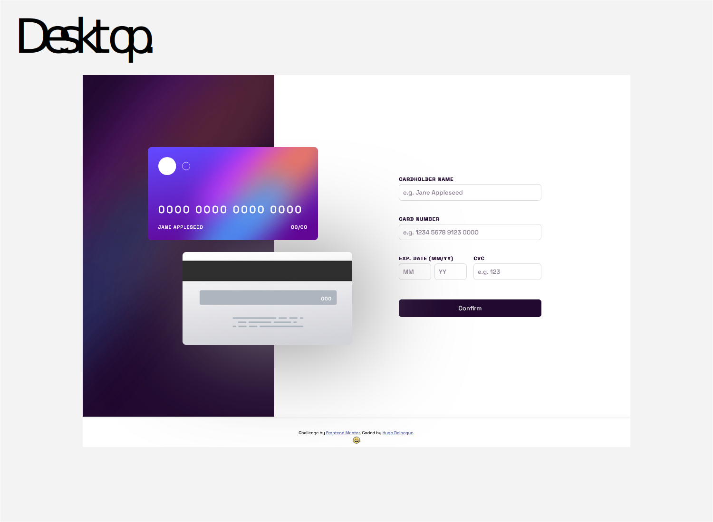
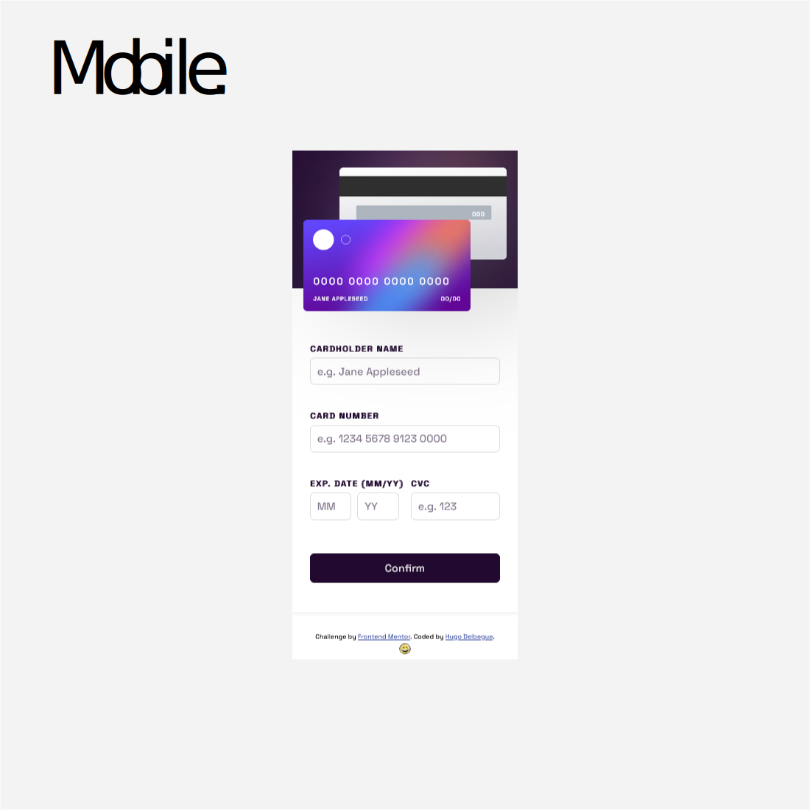

# Interactive card details form solution

This is a solution to the [Interactive card details form challenge on Frontend Mentor](https://www.frontendmentor.io/challenges/interactive-card-details-form-XpS8cKZDWw).

## Table of contents

- [Overview](#overview)
  - [The challenge](#the-challenge)
  - [Screenshot](#screenshot)
  - [Links](#links)
- [My process](#my-process)
  - [Built with](#built-with)
  - [What I learned](#what-i-learned)
  - [Continued development](#continued-development)
  - [Useful resources](#useful-resources)
- [Author](#author)
- [Acknowledgments](#acknowledgments)

## Overview

### The challenge

Users should be able to:

- Fill in the form and see the card details update in real-time
- Receive error messages when the form is submitted if:
  - Any input field is empty
  - The card number, expiry date, or CVC fields are in the wrong format
- View the optimal layout depending on their device's screen size
- See hover, active, and focus states for interactive elements on the page

### Screenshot




### Links

- Solution URL: [https://github.com/hugodelbegue/interactive-card-details-form-main](https://github.com/HUGODELBEGUE/interactive-card-details-form-main)
- Live Site URL: [https://hugodelbegue.github.io/interactive-card-details-form-main](https://hugodelbegue.github.io/interactive-card-details-form-main)

## My process

### Built with

- Semantic HTML5 markup
- CSS custom properties
- Flexbox
- CSS media querie
- Vue data
- Vue computed
- vue event management
- Mobile-first workflow
- [CSS Tools](https://meyerweb.com/eric/tools/css/reset/) - Reset CSS
- [Google Fonts](https://fonts.google.com/) - Fonts imports for typography
- [Sass](https://sass-lang.com/) - CSS language preprocessor
- [Vue.js](https://vuejs.org/) - Vue framework

### What I learned

Returns different classes according to conditions.

```js
template: `<div :class="className"><p>Hello</p></div>`,

data(){
  return {
    active: true
  }
},

computed: {
  className() {
    return {
      errors: !this.active,
      active: this.active
    }
  }
}
```

### Continued development

Thereafter, I will work on the simplification of the forms, the management of their events and their errors as well as their customizations.

### Useful resources

- [Google](https://www.google.com/) - Google search engine.
- [W3 Schools](https://www.w3schools.com/) - Library of Html, CSS and Javascript resources.
- [Developer mozilla](https://developer.mozilla.org/fr/) - Resources for Html CSS and Javascript. Here you will find all the necessary documentation for the methods to be used.
- [Vue.js Documentation](https://vuejs.org/guide/introduction.html) - This is an amazing article which helped me finally understand XYZ. I'd recommend it to anyone still learning this concept.

## Author

- Website - [primalprod.fr](https://primalprod.fr/)
- Frontend Mentor - [@hugodelbegue](https://www.frontendmentor.io/profile/HUGODELBEGUE)
- GitHub - [HUGODELBEGUE](https://github.com/HUGODELBEGUE)

## Acknowledgments

Youtube tutorials:

- Graphikart [https://grafikart.fr/](https://grafikart.fr/)
- DevTheory [DevTheory - Devenir et rester un bon développeur JS.](https://www.youtube.com/@DevTheory)

Online training:

- Codecademy [https://www.codecademy.com/](https://www.codecademy.com/)
