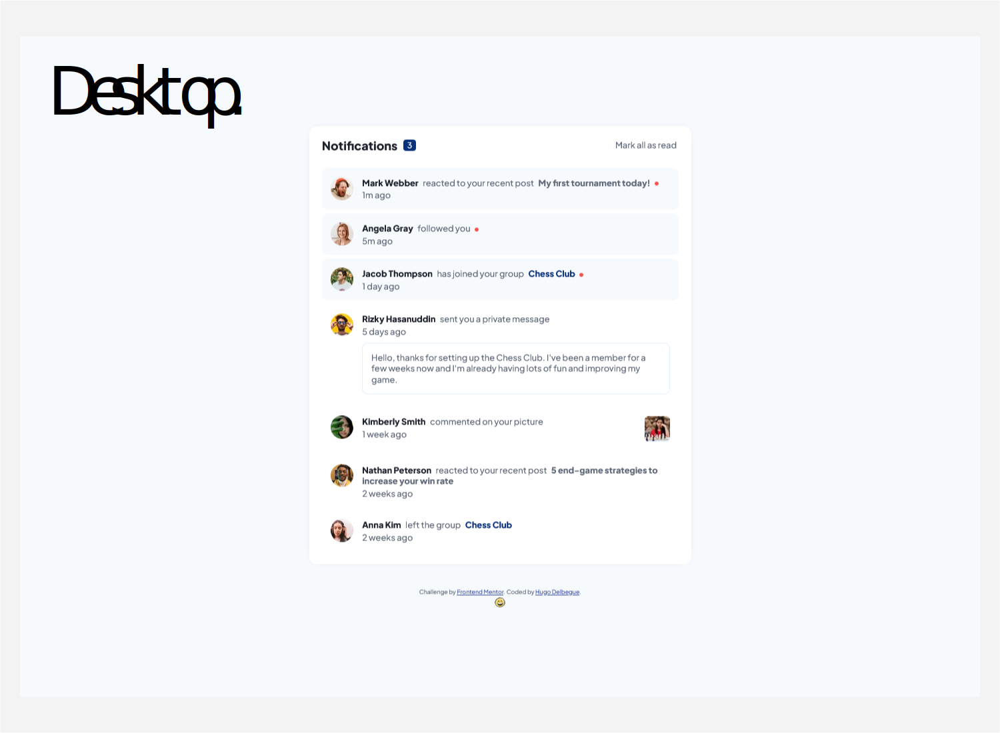
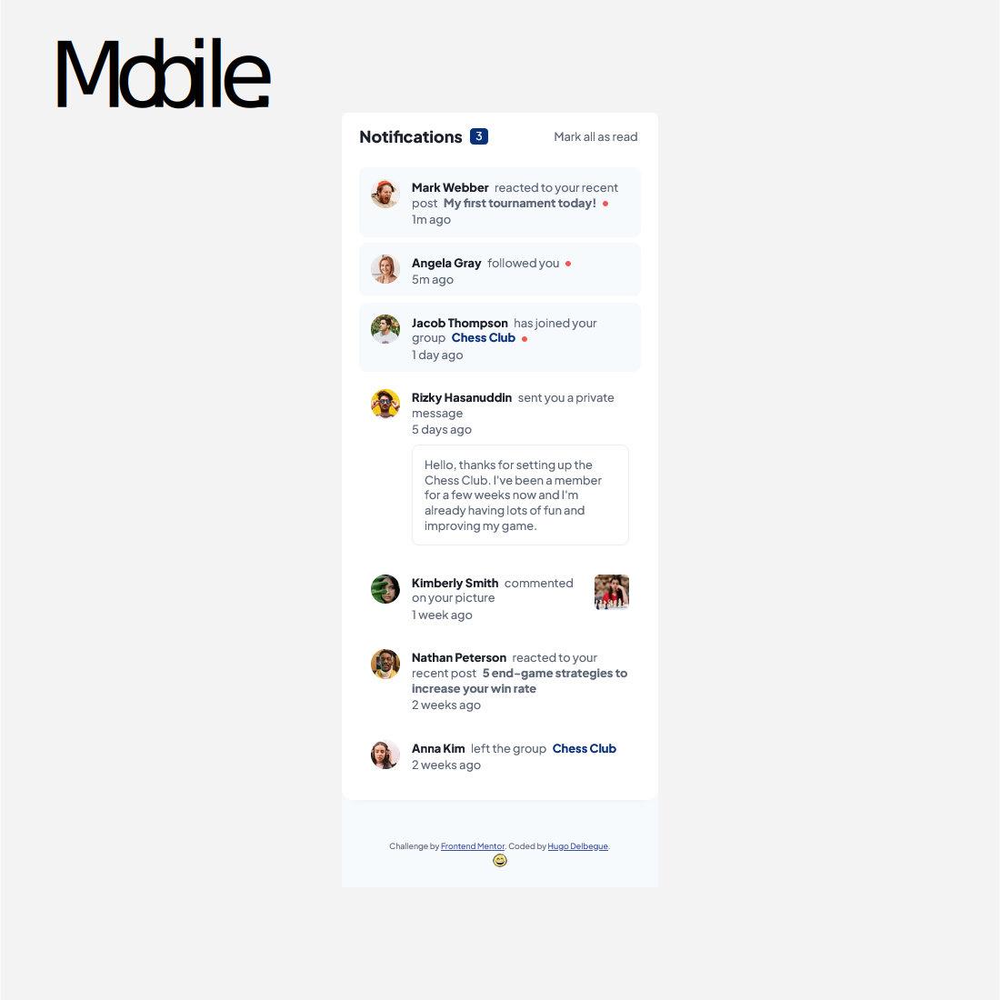

# Notifications page solution

This is a solution to the [Notifications page challenge on Frontend Mentor](https://www.frontendmentor.io/challenges/notifications-page-DqK5QAmKbC).

## Table of contents

- [Overview](#overview)
  - [The challenge](#the-challenge)
  - [Screenshot](#screenshot)
  - [Links](#links)
- [My process](#my-process)
  - [Built with](#built-with)
  - [What I learned](#what-i-learned)
  - [Continued development](#continued-development)
  - [Useful resources](#useful-resources)
- [Author](#author)
- [Acknowledgments](#acknowledgments)

## Overview

### The challenge

Users should be able to:

- Distinguish between "unread" and "read" notifications
- Select "Mark all as read" to toggle the visual state of the unread notifications and set the number of unread messages to zero
- View the optimal layout for the interface depending on their device's screen size
- See hover and focus states for all interactive elements on the page

### Screenshot




### Links

- Solution URL: [https://github.com/HUGODELBEGUE/notifications-page-main](https://github.com/HUGODELBEGUE/notifications-page-main)
- Live Site URL: [https://hugodelbegue.github.io/notifications-page-main/](https://hugodelbegue.github.io/notifications-page-main/)

## My process

### Built with

- Semantic HTML5 markup
- CSS custom properties
- Flexbox
- CSS media querie
- Vue class and style binding
- Vue template syntax
- Vue props
- Vue components
- Vue computed properties
- Mobile-first workflow
- [CSS Tools](https://meyerweb.com/eric/tools/css/reset/) - Reset CSS
- [Google Fonts](https://fonts.google.com/) - Fonts imports for typography
- [Sass](https://sass-lang.com/) - CSS language preprocessor
- [Vue.js](https://vuejs.org/) - Vue framework

### What I learned

Transmission of informations from a parent component to a child component using "Props".

```js
template: `<div>{{ checkLike }}</div>`,

    props: {
      // Data of parent component
        id: Number,
        likes: Array
    },

    computed: {
        checkLike() {
            for (let like of this.likes) {
                if (like.id === this.id) {
                    return 'answer';
                }
            }
        }
    },
```

### Continued development

In my future projects, I will focus on the Vue framework and continue to train in Javascript because it is very important for the good understanding of the framework and its subtleties.

### Useful resources

- [Google](https://www.google.com/) - Google search engine.
- [W3 Schools](https://www.w3schools.com/) - Library of Html, CSS and Javascript resources.
- [Developer mozilla](https://developer.mozilla.org/fr/) - Resources for Html CSS and Javascript. Here you will find all the necessary documentation for the methods to be used.
- [Vue.js Documentation](https://vuejs.org/guide/introduction.html) - This is an amazing article which helped me finally understand XYZ. I'd recommend it to anyone still learning this concept.

## Author

- Website - [primalprod.fr](https://primalprod.fr/)
- Frontend Mentor - [@hugodelbegue](https://www.frontendmentor.io/profile/HUGODELBEGUE)
- GitHub - [HUGODELBEGUE](https://github.com/HUGODELBEGUE)

## Acknowledgments

Youtube tutorials:

- Graphikart [https://grafikart.fr/](https://grafikart.fr/)
- From Scratch [From Scratch - Le développement Web de zéro](https://www.youtube.com/@FromScratchDeveloppementWeb/featured)

Online training:

- Codecademy [https://www.codecademy.com/](https://www.codecademy.com/)
